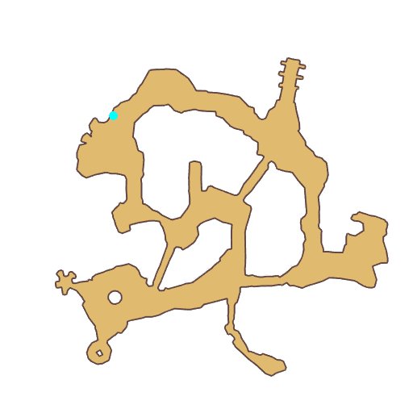

# Quest Ultimate Fight Club

- Id: 99511102
- Steps: 6
- Map: 11

## Steps

### Step 0
- StepName:  Andrew
- Map:  11
- Trace:  
- Type:  acc_satisfaction
- Content:  visit
- Visit NPC 4280, Andrew

- 
- Dialog: (81755)Ha! Here's someone to have some fun with me. - Options: {Chat with him,2},{Turn around and leave,3}

### Step 2
- StepName:  Andrew
- Map:  11
- Trace:  
- Type:  acc_satisfaction
- Content:  dialog
- Dialog: (81756)I was ordered to the underwater world alongside Freeman. Although the crisis here is under control now, I just can't get along with that man. - Options: Why?
- Dialog: (81757)He's bigoted and arrogant. He believes winning proudly in a one-on-one combat is the only way to prove a warrior. - Options: Isn't it?
- Dialog: (81758)Of course not. In the Ultimate Fight Club, we believe in justice, fairness, and openness. If here are two fighters neck and neck, we prefer the one-on-one combat mode.
- Dialog: (81759)If one is way out of the other's league, we allow the weak to bring a helper to ensure the two sides are well matched. - Options: Bring a helper?
- Dialog: (81760)This is a very effective way to train our newcomers. Fighters are not classified into different levels in the Ultimate Fight Club. All we have is our pure pursuit for greater combat strength and better combat skills.

### Step 3
- StepName:  Andrew
- Map:  11
- Trace:  
- Type:  acc_satisfaction
- Content:  visit
- Visit NPC 4280, Andrew

- 
- Dialog: (81761)We encourage the weak to team up together to issue challenges to the strong because this can improve the weak's sense of teamwork and cooperation with a due division of labor. This is essential for all of us during our growth.
- Dialog: (81762)When we are not powerful enough, we need to cooperate with others to obtain what we need. - Options: That's right.
- Dialog: (81763)Adventurer, do you have courage for such a challenge? - Options: {I accept,4},{I refuse,5}

### Step 5
- StepName:  Andrew
- Map:  11
- Trace:  
- Type:  acc_satisfaction
- Content:  dialog
- Dialog: (81765)Adventurer, I'm impressed by your courage. Your decision is very exciting. I look forward to a fight with you. The first thing first. You must learn the basics of combat.
- Dialog: (81766)In this round you are to confront two rivals including me. If you can't judge calmly and analyze our offense habits to find a breaking point, you will very likely lose this fight. - Options: Bring it

### Step 6
- StepName:  Andrew
- Map:  11
- Trace:  
- Type:  acc_satisfaction
- Content:  raid

### Step 7
- StepName:  Andrew
- Map:  11
- Trace:  
- Type:  acc_satisfaction
- Content:  visit
- Visit NPC 4280, Andrew

- 
- Dialog: (81769)You did great. A true warrior!

