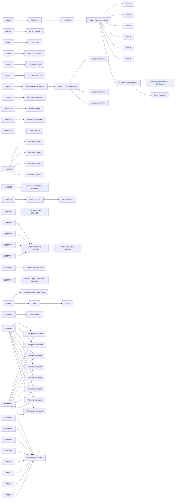

```mermaid
graph LR
	10460001[Ride a Balloon]
	click 10460001 "https://github.com/Borf/romquests/blob/master/10460001.md"
	10450001 --> 10460001
	60000002[Study Jellopy]
	click 60000002 "https://github.com/Borf/romquests/blob/master/60000002.md"
	60000001 --> 60000002
	99200001[Eden Team Turban Blueprint]
	click 99200001 "https://github.com/Borf/romquests/blob/master/99200001.md"
	99190002 --> 99200001
	300051015[Kafra Saving Service]
	click 300051015 "https://github.com/Borf/romquests/blob/master/300051015.md"
	300080068 --> 300051015
	301990101[Heart's Origin Collectible Side Story]
	click 301990101 "https://github.com/Borf/romquests/blob/master/301990101.md"
	301990001 --> 301990101
	396400001[Change the assistant]
	click 396400001 "https://github.com/Borf/romquests/blob/master/396400001.md"
	396380001 --> 396400001
	396390001 --> 396400001
	396410001[Change the assistant]
	click 396410001 "https://github.com/Borf/romquests/blob/master/396410001.md"
	396380001 --> 396410001
	396390001 --> 396410001
	398030001[Personal assistant]
	click 398030001 "https://github.com/Borf/romquests/blob/master/398030001.md"
	396380001 --> 398030001
	396390001 --> 398030001
	398040001[Personal assistant]
	click 398040001 "https://github.com/Borf/romquests/blob/master/398040001.md"
	396380001 --> 398040001
	396390001 --> 398040001
	398060001[Personal assistant]
	click 398060001 "https://github.com/Borf/romquests/blob/master/398060001.md"
	396380001 --> 398060001
	396390001 --> 398060001
	398140001[Personal assistant]
	click 398140001 "https://github.com/Borf/romquests/blob/master/398140001.md"
	396380001 --> 398140001
	396390001 --> 398140001
	398150001[Personal assistant]
	click 398150001 "https://github.com/Borf/romquests/blob/master/398150001.md"
	396380001 --> 398150001
	396390001 --> 398150001
	400080001[South Gate Mini Map Guide]
	click 400080001 "https://github.com/Borf/romquests/blob/master/400080001.md"
	10009 --> 400080001
	10004[Trial 3]
	click 10004 "https://github.com/Borf/romquests/blob/master/10004.md"
	10009 --> 10004
	40002[Go to Prontera]
	click 40002 "https://github.com/Borf/romquests/blob/master/40002.md"
	40100 --> 40002
	60003[Yimir Heart]
	click 60003 "https://github.com/Borf/romquests/blob/master/60003.md"
	60002 --> 60003
	60007[Demon King's Seal]
	click 60007 "https://github.com/Borf/romquests/blob/master/60007.md"
	60006 --> 60007
	60011[Floating Garden]
	click 60011 "https://github.com/Borf/romquests/blob/master/60011.md"
	60010 --> 60011
	10120[South Gate group photo NPC deleted]
	click 10120 "https://github.com/Borf/romquests/blob/master/10120.md"
	10010 --> 10120
	399800001[Mercenary Cat Daily]
	click 399800001 "https://github.com/Borf/romquests/blob/master/399800001.md"
	602180001 --> 399800001
	602190001 --> 399800001
	602200001 --> 399800001
	602210001 --> 399800001
	400001 --> 399800001
	400002 --> 399800001
	400003 --> 399800001
	400004 --> 399800001
	70002[First Time in Izlude]
	click 70002 "https://github.com/Borf/romquests/blob/master/70002.md"
	99090006 --> 70002
	204360002[Underwater Cave Collectible]
	click 204360002 "https://github.com/Borf/romquests/blob/master/204360002.md"
	204360001 --> 204360002
	100004[Underwater Cave, Byalan]
	click 100004 "https://github.com/Borf/romquests/blob/master/100004.md"
	100003 --> 100004
	398090001[Change the assistant]
	click 398090001 "https://github.com/Borf/romquests/blob/master/398090001.md"
	396380001 --> 398090001
	396390001 --> 398090001
	120002[Nes from Baphomet]
	click 120002 "https://github.com/Borf/romquests/blob/master/120002.md"
	120001 --> 120002
	20540001[Secret of the Statue]
	click 20540001 "https://github.com/Borf/romquests/blob/master/20540001.md"
	30000001 --> 20540001
	99160102[Izlude side quest]
	click 99160102 "https://github.com/Borf/romquests/blob/master/99160102.md"
	99160101 --> 99160102
	99160103[Izlude side quest]
	click 99160103 "https://github.com/Borf/romquests/blob/master/99160103.md"
	99160101 --> 99160103
	99160104[Izlude side quest]
	click 99160104 "https://github.com/Borf/romquests/blob/master/99160104.md"
	99160101 --> 99160104
	99160105[Izlude side quest]
	click 99160105 "https://github.com/Borf/romquests/blob/master/99160105.md"
	99160101 --> 99160105
	99540002[Naughty Ghost]
	click 99540002 "https://github.com/Borf/romquests/blob/master/99540002.md"
	99540001 --> 99540002
	99540003[Naughty Ghost]
	click 99540003 "https://github.com/Borf/romquests/blob/master/99540003.md"
	99540002 --> 99540003
	306000002[Cheerful child]
	click 306000002 "https://github.com/Borf/romquests/blob/master/306000002.md"
	306000001 --> 306000002
	204380001[Underwater Cave Collectible]
	click 204380001 "https://github.com/Borf/romquests/blob/master/204380001.md"
	204370001 --> 204380001
	204370002 --> 204380001
	204370003 --> 204380001
	204370004 --> 204380001
	204380002[Underwater Cave Collectible]
	click 204380002 "https://github.com/Borf/romquests/blob/master/204380002.md"
	204380001 --> 204380002
	100005[Byalan, Underwater Cave]
	click 100005 "https://github.com/Borf/romquests/blob/master/100005.md"
	100004 --> 100005
	100006[Underwater Cave]
	click 100006 "https://github.com/Borf/romquests/blob/master/100006.md"
	100005 --> 100006
	100007[Underwater Cave]
	click 100007 "https://github.com/Borf/romquests/blob/master/100007.md"
	100005 --> 100007
	100008[Underwater Cave]
	click 100008 "https://github.com/Borf/romquests/blob/master/100008.md"
	100005 --> 100008
	10005[Trial 3]
	click 10005 "https://github.com/Borf/romquests/blob/master/10005.md"
	10004 --> 10005
	10007[Final Test]
	click 10007 "https://github.com/Borf/romquests/blob/master/10007.md"
	10006 --> 10007
	10008[Final Test]
	click 10008 "https://github.com/Borf/romquests/blob/master/10008.md"
	10007 --> 10008
	10011[South Gate group photo]
	click 10011 "https://github.com/Borf/romquests/blob/master/10011.md"
	10008 --> 10011
	10061[Trial 3]
	click 10061 "https://github.com/Borf/romquests/blob/master/10061.md"
	10011 --> 10061
	10062[Trial 3]
	click 10062 "https://github.com/Borf/romquests/blob/master/10062.md"
	10011 --> 10062
	10063[Trial 3]
	click 10063 "https://github.com/Borf/romquests/blob/master/10063.md"
	10011 --> 10063
	10064[Trial 3]
	click 10064 "https://github.com/Borf/romquests/blob/master/10064.md"
	10011 --> 10064
	10065[Trial 3]
	click 10065 "https://github.com/Borf/romquests/blob/master/10065.md"
	10011 --> 10065
	10066[Trial 3]
	click 10066 "https://github.com/Borf/romquests/blob/master/10066.md"
	10011 --> 10066
	10010[South Gate group photo]
	click 10010 "https://github.com/Borf/romquests/blob/master/10010.md"
	10011 --> 10010
	40001[Go to Prontera]
	click 40001 "https://github.com/Borf/romquests/blob/master/40001.md"
	10010 --> 40001
```